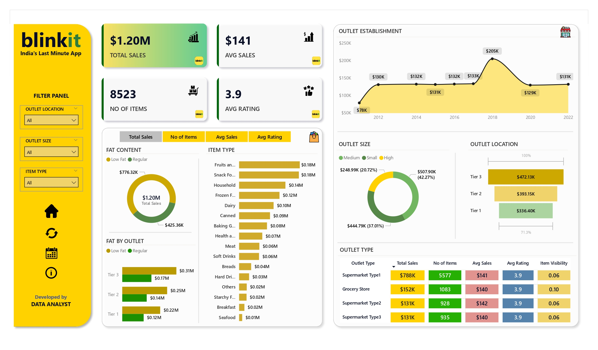
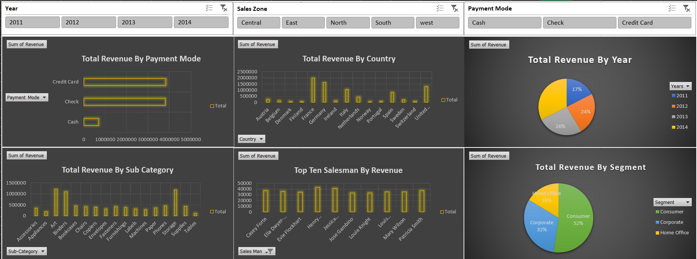

# Muhammed Faseen Kayakkal

**📊 Data Analyst | Power BI | SQL | Excel | Data Visualization**

---

### 🔹 About Me
I’m a results-driven Data Analyst with experience in converting data into actionable insights using Power BI, SQL, and Excel. My mission is to help organizations make better decisions through clean dashboards, KPI tracking, and automation.

---

### 💼 Experience

**Data Analyst Intern – Rows And Columns, Calicut**  
Feb 2025 – Present  
- Built dashboards using Power BI & SQL  
- Improved reporting turnaround by 15%  
- Tracked KPIs and identified trends to support decision-making

**Operations Manager – Al Nas Graphics, Sharjah**  
Oct 2022 – Oct 2024  
- Managed operations and implemented Excel-based tracking  
- Achieved a 20% improvement in on-time delivery

---

## 📊 Featured Projects

### CRM Analytics Dashboard

Analyzed employee attrition, demographics, and performance using Power BI and SQL.  
[🔗 View on LinkedIn](https://www.linkedin.com/posts/muhammed-faseen-kayakkal-58aa67220_powerbi-sql-hranalytics-activity-7320416205645787136-lTAV)

---

### CRM Sales Dashboard

Visualized sales funnel, lead conversion, and revenue using Power BI and DAX.  
[🔗 View on LinkedIn](https://www.linkedin.com/posts/muhammed-faseen-kayakkal-58aa67220_powerbi-retailanalytics-datavisualization-activity-7328592399415283712-a_4J)

---

### Global Revenue Dashboard

Designed interactive dashboards for region-wise revenue insights and trend analysis.  
[🔗 View on LinkedIn](https://www.linkedin.com/in/muhammed-faseen-kayakkal-58aa67220/details/projects/1747268125354/single-media-viewer/)

---

### 🎓 Education
**MCA – IGNOU** *(2023 – Present)*  
**BCA – University of Calicut** *(2019 – 2022)*

---

### 📬 Contact
📧 faseenfaizaan@gmail.com  
📱 +91 8113989918  
🔗 [LinkedIn](https://www.linkedin.com/in/muhammed-faseen-kayakkal-58aa67220/)

