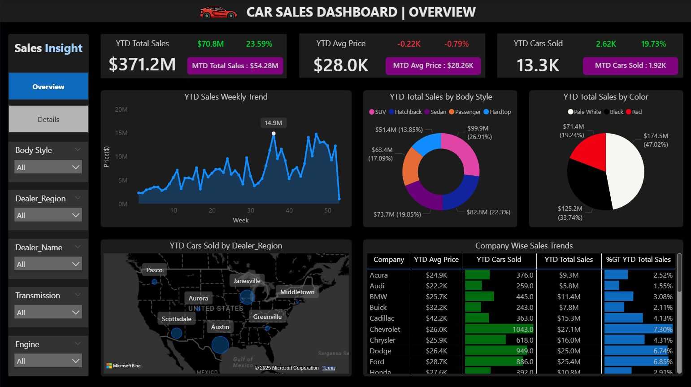
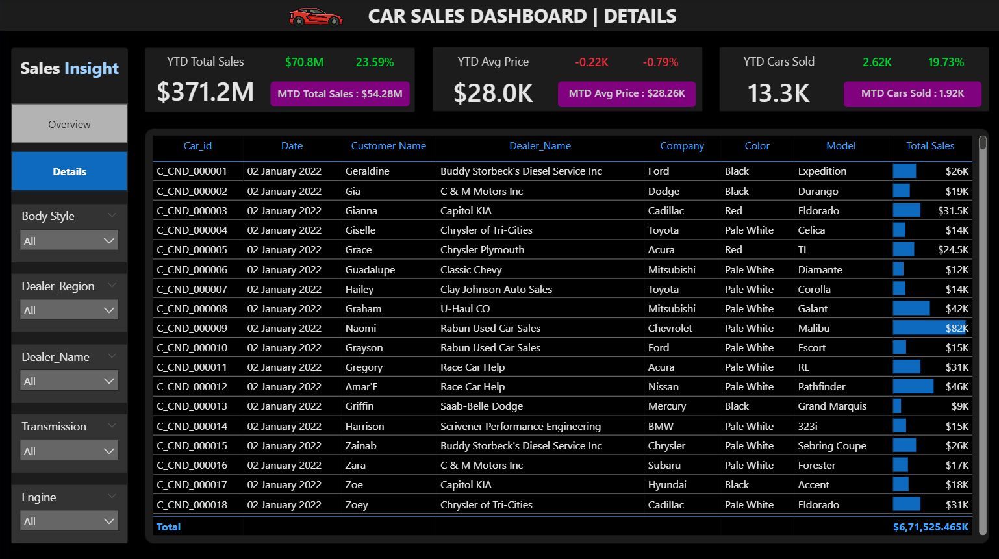
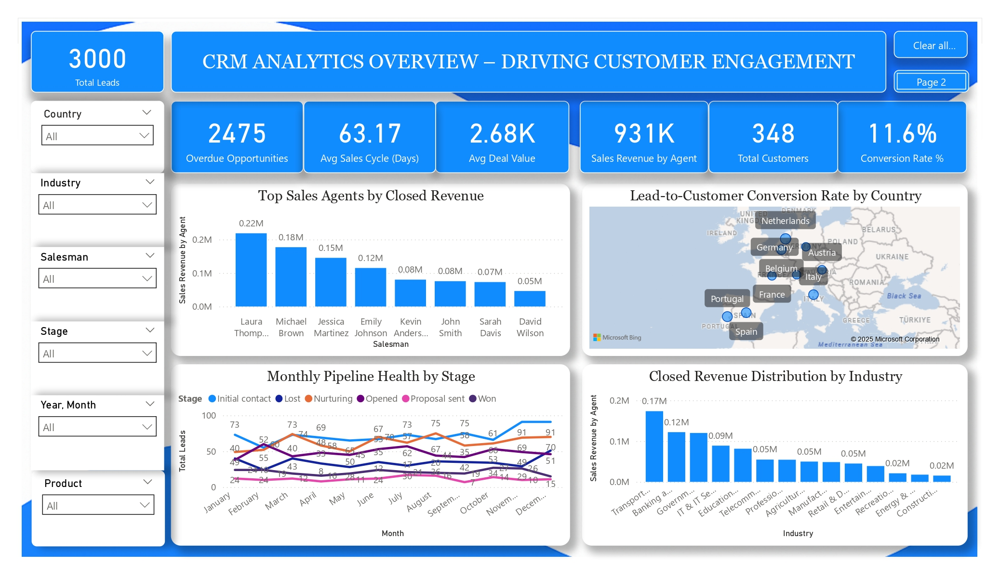
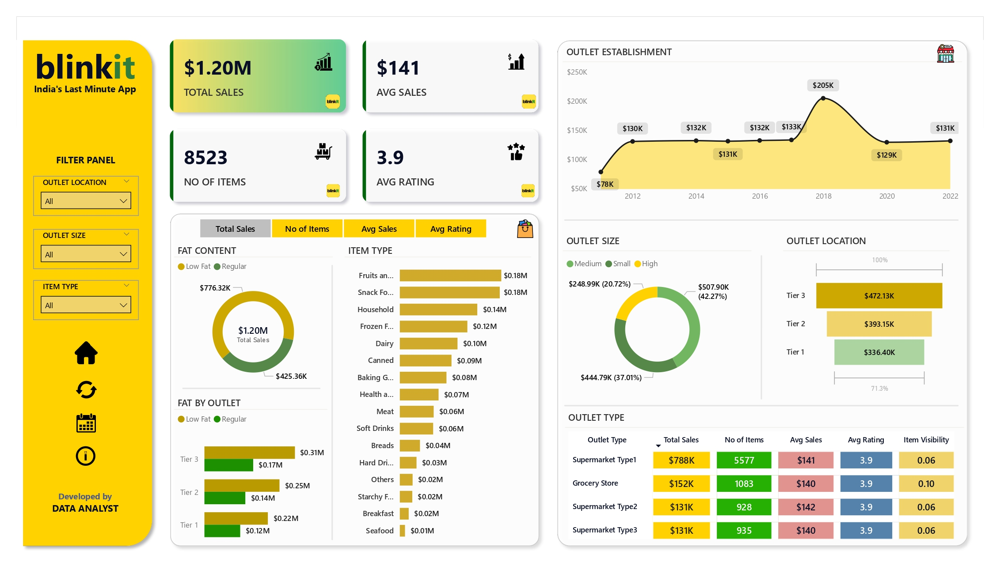
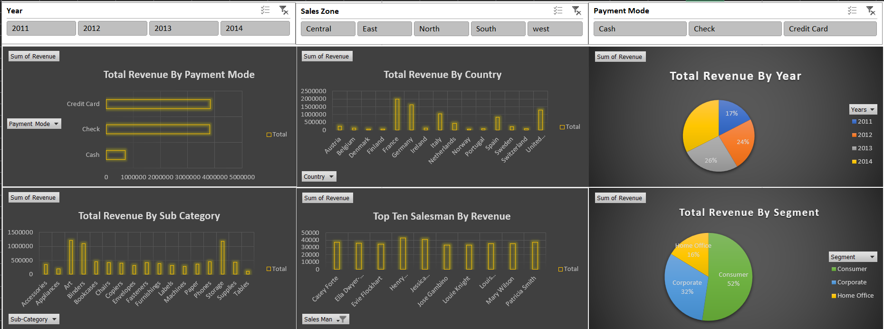

📊 Data Analyst | Power BI | SQL | Python | Excel | Azure
🔹 About Me
I’m a data-driven analyst with 3+ years of experience transforming raw data into actionable insights using Power BI, SQL, Excel, and Python. I specialize in building interactive dashboards, optimizing workflows, and automating reports to improve business decision-making. With hands-on expertise in CRM, ERP, and operational data, I focus on analytics that support sales, service, and supply chain strategies. Passionate about learning, I apply UX/UI principles and collaborate across teams to drive clarity, performance, and measurable impact.

💼 Experience
Business Support Analyst – Al Nas Graphics, Sharjah
Oct 2022 – Dec 2024

Built and automated Power BI dashboards to track KPIs for sales, inventory, and delivery.

Collaborated cross-functionally to eliminate service bottlenecks and improve reporting accuracy.

Reduced manual reporting by 15% using Excel automation and Azure integration.

Data Analyst Intern – Rows And Columns, Calicut
Jan 2025 – Present

Developed SQL and Power BI dashboards for CRM and customer performance tracking.

Streamlined data workflows and supported insight delivery for CX and sales teams.

Software Intern – Talrop Private Limited, Kerala
2019 – 2022

Assisted with internal software deployment and data support projects.

🧠 Skills & Tools
Data Visualization: Power BI, Excel Dashboards, Tableau
Data Handling: SQL Server, MySQL, Azure Data Studio, Excel Power Query
Programming: Python (Pandas, NumPy, Matplotlib, Seaborn), DAX, M
Automation & Deployment: Power BI Service, Power Automate, Azure Synapse
UI/UX: Figma, Canva, Wireframing, Layout Design
Collaboration Tools: Jira, Trello, Notion, GitHub, Bitbucket
Soft Skills: Data Storytelling, Business Acumen, Stakeholder Collaboration, Time Management
---

🏅 Certifications
- PL-300 Certification 
- Microsoft Power BI Data Analyst Professional
- SQL: Beginner to Advanced for Data Professionals
- Software Internship

---

## 📊 Featured Projects

### CAR SALES INSIGHT DASHBOARD 

Analyzed employee attrition, demographics, and performance using Power BI and SQL.  
[🔗 View on LinkedIn]([https://www.linkedin.com/posts/muhammed-faseen-kayakkal-58aa67220_powerbi-sql-hranalytics-activity-7320416205645787136-lTAV](https://www.linkedin.com/in/muhammed-faseen-kayakkal-58aa67220/details/projects/102106673/multiple-media-viewer/?profileId=ACoAADevkHoBPQJVjAyTl0HxGuXamGSqTSy2f1k&treasuryMediaId=1748153862993))

---

### CRM ANALYTICS DASHBOARD

Analyzed employee attrition, demographics, and performance using Power BI and SQL.  
[🔗 View on LinkedIn](https://www.linkedin.com/posts/muhammed-faseen-kayakkal-58aa67220_powerbi-sql-hranalytics-activity-7320416205645787136-lTAV)

---

### BLINKIT RETAIL SALES DASHBOARD

Visualized sales funnel, lead conversion, and revenue using Power BI and DAX.  
[🔗 View on LinkedIn](https://www.linkedin.com/posts/muhammed-faseen-kayakkal-58aa67220_powerbi-retailanalytics-datavisualization-activity-7328592399415283712-a_4J)

---

### GLOBAL REVENUE DASHBOARD

Designed interactive dashboards for region-wise revenue insights and trend analysis.  
[🔗 View on LinkedIn](https://www.linkedin.com/in/muhammed-faseen-kayakkal-58aa67220/details/projects/1747268125354/single-media-viewer/)

---

### 🎓 Education
**MCA – IGNOU** *(2023 – Present)*  
**BCA – University of Calicut** *(2019 – 2022)*

---

🌱 Interests
- Data Visualization & Storytelling
- Business Intelligence & Dashboards
- Process Optimization
- Data-Driven Decision Making
- Learning new analytics tools & technologies

---

### 📬 Contact
📧 faseenfaizaan@gmail.com  
📱 +91 8113989918  
🔗 [LinkedIn](https://www.linkedin.com/in/muhammed-faseen-kayakkal-58aa67220/)

